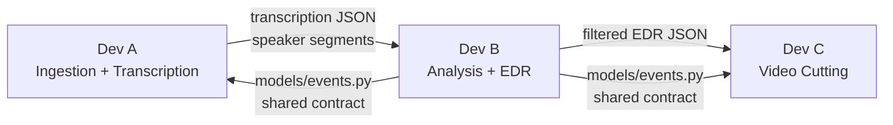

# 3-Developer Parallel Work Plan

## File Ownership

Each developer owns specific files exclusively. No two devs edit the same file (except `config/settings.py` where each dev adds their own section).

### Dev A — Infrastructure, Ingestion and Transcription (Stages 1-2)

**Files owned:**

- [main.py](main.py) — CLI entry point and pipeline orchestration
- [config/settings.py](config/settings.py) — global settings structure (all devs append to it)
- [utils/logger.py](utils/logger.py) — logging config
- [utils/cache.py](utils/cache.py) — caching / checkpointing logic
- [pipeline/ingestion.py](pipeline/ingestion.py) — Stage 1 (yt-dlp download, ffprobe metadata, validation)
- [pipeline/transcription.py](pipeline/transcription.py) — Stage 2 (audio extraction, AssemblyAI, speaker diarization, commentator ID)
- [tests/conftest.py](tests/conftest.py) — shared test fixtures
- [tests/test_ingestion.py](tests/test_ingestion.py)
- [tests/test_transcription.py](tests/test_transcription.py)

**Responsibilities:** This dev builds the foundation that every other stage depends on — the caching layer, the logging setup, and the first two pipeline stages that produce the transcription JSON. Also owns `main.py` which wires all stages together (will integrate B's and C's stages in Phase 3).

---

### Dev B — Analysis and EDR Core (Stages 3-4, TDD)

**Files owned:**

- [models/events.py](models/events.py) — shared data models (EDR entry dataclass, EventType enum)
- [config/keywords.py](config/keywords.py) — football keyword lists with excitement weights
- [pipeline/excitement.py](pipeline/excitement.py) — Stage 3 (vocal energy via librosa, keyword matching, LLM classification)
- [pipeline/edr.py](pipeline/edr.py) — Stage 4 (scoring, merging signals, clip window selection, overlap handling)
- [pipeline/filtering.py](pipeline/filtering.py) — Stage 4b (event type filtering, duration-constrained selection)
- [tests/test_excitement.py](tests/test_excitement.py)
- [tests/test_edr.py](tests/test_edr.py) — **TDD target**
- [tests/test_filtering.py](tests/test_filtering.py) — **TDD target**

**Responsibilities:** This dev owns the brain of the system — all the analysis logic and the EDR. Crucially, this dev defines `models/events.py` first (Phase 1, day 1), since it is the shared contract that A and C code against. The EDR and filtering modules are developed via TDD as required by the spec.

---

### Dev C — Video Output and DevOps (Stage 5 + Deployment)

**Files owned:**

- [utils/ffmpeg.py](utils/ffmpeg.py) — ffmpeg/ffprobe helper functions (cutting, concatenation, overlays)
- [pipeline/video.py](pipeline/video.py) — Stage 5 (clip cutting, text overlays, fade transitions, concatenation)
- [tests/test_video.py](tests/test_video.py)
- [Dockerfile](Dockerfile)
- [.pre-commit-config.yaml](.pre-commit-config.yaml)
- [pyproject.toml](pyproject.toml) — ruff/mypy/pytest config
- [requirements.txt](requirements.txt)
- [README.md](README.md)

**Responsibilities:** This dev owns the final output stage (turning an EDR into an actual video) and all DevOps/CI concerns — Docker, pre-commit hooks, static analysis config, dependency management, and Azure deployment.

---

## Development Phases

```mermaid
gantt
    title Development Timeline
    dateFormat  X
    axisFormat %s

    section Phase1
    Dev_A: Logging, caching, main.py skeleton :a1, 0, 3
    Dev_B: models/events.py shared contract    :b1, 0, 1
    Dev_B: TDD tests for EDR and filtering     :b2, 1, 3
    Dev_C: Pre-commit, Docker, pyproject, ffmpeg helpers :c1, 0, 3

    section Phase2
    Dev_A: Stage 1 ingestion            :a2, 3, 6
    Dev_A: Stage 2 transcription        :a3, 6, 9
    Dev_B: Stage 3 excitement analysis  :b3, 3, 6
    Dev_B: Stage 4 EDR generation       :b4, 6, 8
    Dev_B: Stage 4b filtering           :b5, 8, 9
    Dev_C: Stage 5 video cutting        :c2, 3, 7
    Dev_C: Azure deployment setup       :c3, 7, 9

    section Phase3
    All: Integration in main.py         :all1, 9, 10
    All: End-to-end testing and tuning  :all2, 10, 12
```


### Phase 1 — Foundations (parallel kickoff)

- **Dev A:** Set up `utils/logger.py` (logging config used by all stages), `utils/cache.py` (checkpointing pattern), `main.py` skeleton (stage runner with caching checks)
- **Dev B:** Define `models/events.py` with the `EDREntry` dataclass and `EventType` enum **first** — push this immediately so A and C can import it. Then write the TDD test cases for `test_edr.py` and `test_filtering.py` (tests will fail, implementation comes in Phase 2)
- **Dev C:** Configure `.pre-commit-config.yaml`, `pyproject.toml`, install hooks. Build `utils/ffmpeg.py` helper functions (run ffprobe, cut clip, concat clips). Set up `Dockerfile`

### Phase 2 — Core implementation (parallel)

- **Dev A:** Implement Stage 1 (`pipeline/ingestion.py` — download, validate, extract metadata) and Stage 2 (`pipeline/transcription.py` — audio extraction, AssemblyAI call, commentator identification). Write tests for both
- **Dev B:** Implement Stage 3 (`pipeline/excitement.py` — librosa energy analysis, keyword matching, LLM calls with caching). Then implement Stage 4 (`pipeline/edr.py`) and Stage 4b (`pipeline/filtering.py`) to make the TDD tests pass
- **Dev C:** Implement Stage 5 (`pipeline/video.py` — cut clips from EDR, add overlays, fade transitions, concatenate). Can test independently using a hand-crafted mock EDR JSON. Start Azure deployment config

### Phase 3 — Integration and polish (collaborative)

- **Dev A:** Wire all stages together in `main.py`, implement the full pipeline runner with caching
- **Dev B:** Parameter tuning (keyword weights, scoring formula, energy thresholds)
- **Dev C:** Finalize Azure deployment, update `README.md` with final instructions, ensure coverage report passes
- **All three:** End-to-end testing on a real match, fix integration bugs

---

## Shared Contract (critical for parallel work)

Dev B must define and push [models/events.py](models/events.py) on day 1. This file should contain at minimum:

- `EventType` — an enum with values: `goal`, `shot_on_target`, `save`, `foul`, `card`, `corner`, `free_kick`, `counter_attack`, `celebration`, `penalty`, `var_review`, `other`
- `EDREntry` — a dataclass with fields: `timestamp_start`, `timestamp_end`, `commentator_energy`, `commentator_text`, `keyword_matches`, `event_type`, `llm_description`, `llm_excitement_score`, `final_score`, `include_in_highlights`
- `VideoMetadata` — a dataclass with fields: `video_id`, `duration`, `resolution`, `fps`, `path`

This is the interface that connects all three devs' work. Dev A produces data that flows into Dev B's stages, and Dev B produces the EDR that Dev C consumes for video cutting.

---

## Dependency Flow Between Devs




Dev B's models are the glue. The actual data flows at runtime from A to B to C, but the code contract (`models/events.py`) must be agreed on first.