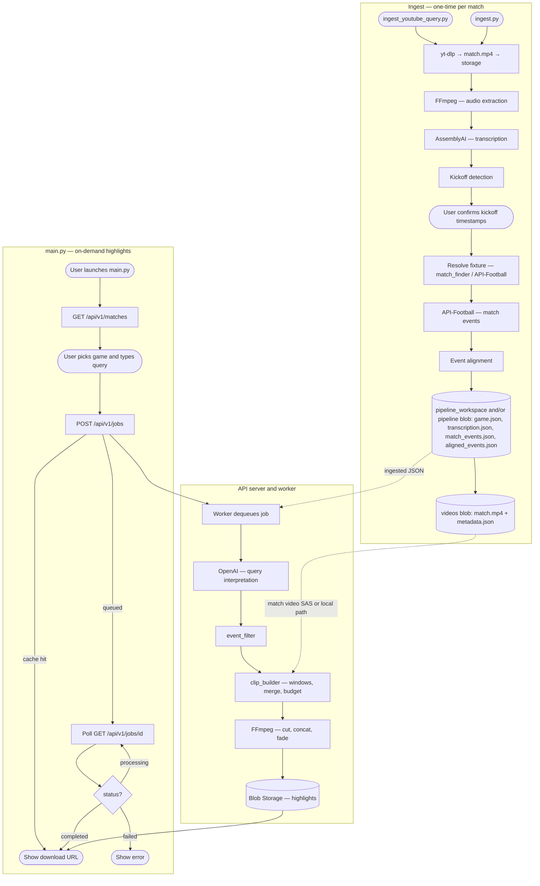

# Football Highlights Generator

Builds a highlights video from a full football match by combining **[API-Football](https://www.api-football.com/)** event data (goals, cards, VAR, etc.) with **commentary transcription** to align match minutes to video time, then cuts and merges clips with **FFmpeg**.

The pipeline is split into two stages:

- **`scripts/ingest_youtube_query.py`** — primary operator tool: **search YouTube** (ytsearch), confirm the video, update **`catalog/data/matches.json`**, download, run the full ingest pipeline, and **upload to Azure Blob Storage** by default (use **`--local`** only for dev without Azure). This is what you use to put matches in front of the deployed API.
- **`ingest.py`** — alternative entrypoint: pick a **catalog** match interactively (YouTube URL or query), same pipeline stages; storage is **`pipeline_workspace/`** or Azure Blob depending on **`STORAGE_BACKEND`** / **`AZURE_STORAGE_CONNECTION_STRING`** in config (see `config/settings.py`).
- **`main.py`** — thin client to the API: list matches, submit highlight jobs, poll for results.



## Prerequisites

| Dependency | Why | Install |
|------------|-----|---------|
| **Python 3.12+** | Runtime | [python.org](https://www.python.org/downloads/) |
| **FFmpeg** | Video download (yt-dlp merge), audio extraction, clip cutting & concatenation | `brew install ffmpeg` (macOS) · `sudo apt install ffmpeg` (Ubuntu) · [ffmpeg.org](https://ffmpeg.org/download.html) |

Verify FFmpeg is available:

```bash
ffmpeg -version
```

## Setup

```bash
python -m venv .venv
source .venv/bin/activate
pip install -r requirements.txt
pre-commit install
```

## Environment

Create a `.env` file in the project root (see `.gitignore` — never commit secrets):

| Variable | Purpose |
|----------|---------|
| `ASSEMBLYAI_API_KEY` | Transcribe match audio (AssemblyAI) |
| `API_FOOTBALL_KEY` | Fetch fixtures/events from `v3.football.api-sports.io` (same key as RapidAPI / API-Sports) |
| `OPENAI_API_KEY` | Interpret natural-language highlight queries (API worker / query pipeline) |
| `AZURE_STORAGE_CONNECTION_STRING` | **Ingest to Azure Blob** from `scripts/ingest_youtube_query.py` (omit only if you pass `--local` for dev) |

For local development you can also load secrets from Key Vault — see `scripts/load_env_from_keyvault.sh` and `docs/DEPLOY.md`.

**API-Football free tier:** daily request limits apply, and **fixture data is often limited to a short rolling window of dates**. For older matches you may need a paid tier.

## Usage

### Step 1 — Ingest a match (once per game)

**Recommended — `scripts/ingest_youtube_query.py` (Azure + catalog)**

Runs on your machine (not inside the API container). From the repo root, with a venv activated:

```bash
source .venv/bin/activate
python scripts/ingest_youtube_query.py "Manchester United Liverpool FA Cup 2024 full match"
```

Flow in short:

1. **ytsearch** on YouTube — you confirm the hit (title + duration).
2. **`match_id`** — you confirm or edit the catalog slug; `catalog/data/matches.json` is updated.
3. **Fixture** — API-Football resolution when possible (or you fix `fixture_id` later).
4. **Download** — `yt-dlp` writes `match.mp4` (unless **`--resume`** and the blob already has a video).
5. **Pipeline** — audio extract → AssemblyAI → kickoff confirmation → API-Football events → alignment.
6. **Storage** — writes **`videos/<match_id>/`** (`match.mp4`, `metadata.json`) and **`pipeline/<match_id>/`** (`game.json`, `transcription.json`, `match_events.json`, `aligned_events.json`, …) in Azure Blob when `AZURE_STORAGE_CONNECTION_STRING` is set (or fetched via `az` + `AZURE_STORAGE_ACCOUNT` / `AZURE_RESOURCE_GROUP`).

Useful flags:

| Flag | Meaning |
|------|--------|
| `--resume` | Skip download if `match.mp4` is already in storage; continue ingest. |
| `--local` | Allow falling back to **`pipeline_workspace/`** when Azure is unavailable (not for production). |
| `--no-ingest` | Catalog + download only. |

Without Azure credentials the script **exits** unless you pass **`--local`**.

### Step 2 — Generate highlights (on demand)

Point `API_BASE_URL` at your running API (default `http://localhost:8000`), then:

```bash
python main.py
```

The REPL fetches matches from the API, lets you pick a game, submits a highlight job, and prints a **download URL** when the worker finishes (highlights live in Azure Blob Storage when deployed).

Example queries:

```
> show me a full summary
> just goals and penalties
> Salah moments
> highlights from the second half
```

Type `back` to pick a different game, `quit` to exit.

## Workspace

- **Local storage (`STORAGE_BACKEND` local, or `ingest_youtube_query.py --local`):** `pipeline_workspace/<video_id>/` holds the same artifacts as below (ignored by git except `.gitkeep`).
- **Deployed / Azure ingest:** Blob Storage containers mirror that layout — **`videos/<match_id>/`** (e.g. `match.mp4`, `metadata.json`), **`pipeline/<match_id>/`** (e.g. `game.json`, `aligned_events.json`, transcription, events JSON), **`highlights/<match_id>/`** for generated highlight files.

```
pipeline_workspace/   # local only
  <video_id>/
    metadata.json
    match_events.json
    transcription.json
    aligned_events.json
    game.json
    highlights_<slug>.mp4
    …
```

## Testing

```bash
pytest
```

## Code style

Type annotations on all functions. See [CONTRIBUTING.md](CONTRIBUTING.md).

## Static analysis

Runs on commit via pre-commit (ruff, mypy, bandit). Manual run:

```bash
ruff check .
mypy .
bandit -r . -c pyproject.toml
```

## Azure

- **Deploy the API/worker:** `docs/DEPLOY.md` and `scripts/deploy_azure_env.sh`
  - Full deploy (first-time setup or infra changes): `./scripts/deploy_azure_env.sh`
  - Code-only deploy (routine updates, no infra changes): `./scripts/deploy_azure_env.sh --code-only`
    Skips provider registration and ARM template re-deployment — just builds and pushes the Docker image and updates both container apps. Use this when you only changed application code.
- **Add matches to storage (operator):** `python scripts/ingest_youtube_query.py "…"` with `AZURE_STORAGE_CONNECTION_STRING` (or Azure CLI–discoverable storage account settings as in the script docstring)
- **Teammate access (RBAC):** `docs/AZURE_RBAC.md`

## Legacy pipeline

Modules such as `pipeline/excitement.py`, `pipeline/edr.py`, and `pipeline/filtering.py` implement an older audio/LLM-based path and are not used by the default pipeline.
