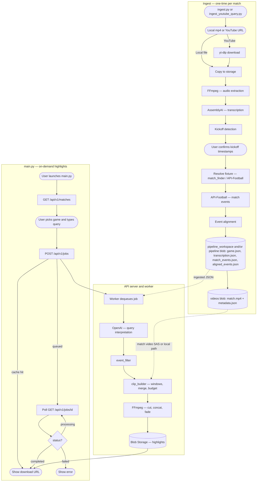

# Football Highlights Generator

Builds a highlights video from a full football match by combining **[API-Football](https://www.api-football.com/)** event data (goals, cards, VAR, etc.) with **commentary transcription** to align match minutes to video time, then cuts and merges clips with **FFmpeg**.

The pipeline is split into two stages:

- **`ingest.py`** (or **`scripts/ingest_youtube_query.py`** for Azure-oriented upload) — one-time preprocessing per match (download, transcription, event alignment)
- **`main.py`** — thin client to the API: list matches, submit highlight jobs, poll for results



## Prerequisites

| Dependency | Why | Install |
|------------|-----|---------|
| **Python 3.12+** | Runtime | [python.org](https://www.python.org/downloads/) |
| **FFmpeg** | Video download (yt-dlp merge), audio extraction, clip cutting & concatenation | `brew install ffmpeg` (macOS) · `sudo apt install ffmpeg` (Ubuntu) · [ffmpeg.org](https://ffmpeg.org/download.html) |

Verify FFmpeg is available:

```bash
ffmpeg -version
```

## Setup

```bash
python -m venv .venv
source .venv/bin/activate
pip install -r requirements.txt
pre-commit install
```

## Environment

Create a `.env` file in the project root (see `.gitignore` — never commit secrets):

| Variable | Purpose |
|----------|---------|
| `ASSEMBLYAI_API_KEY` | Transcribe match audio (AssemblyAI) |
| `API_FOOTBALL_KEY` | Fetch fixtures/events from `v3.football.api-sports.io` (same key as RapidAPI / API-Sports) |
| `OPENAI_API_KEY` | Interpret natural-language highlight queries (used by `main.py`) |

**API-Football free tier:** daily request limits apply, and **fixture data is often limited to a short rolling window of dates**. For older matches you may need a paid tier.

## Usage

### Step 1 — Ingest a match (once per game)

```bash
source .venv/bin/activate
python ingest.py
```

Enter a YouTube URL or a match description (e.g. `Champions League final 2024`). The script:

1. Downloads the full match video
2. Fetches match events from API-Football
3. Transcribes commentary (AssemblyAI)
4. Asks you to confirm detected first/second-half kickoff timestamps (enter manually in `M:SS` or seconds if not detected)
5. Aligns API events to video time
6. Writes a ready-to-query game record under `pipeline_workspace/<video_id>/`

Each match only needs to be ingested once. Outputs are cached — re-running skips completed stages.

### Step 2 — Generate highlights (on demand)

Point `API_BASE_URL` at your running API (default `http://localhost:8000`), then:

```bash
python main.py
```

The REPL fetches matches from the API, lets you pick a game, submits a highlight job, and prints a **download URL** when the worker finishes (highlights live in Azure Blob Storage when deployed).

Example queries:

```
> show me a full summary
> just goals and penalties
> Salah moments
> highlights from the second half
```

Type `back` to pick a different game, `quit` to exit.

## Workspace

Downloaded videos, JSON caches, and highlights videos are stored under `pipeline_workspace/` (ignored by git except `.gitkeep`).

```
pipeline_workspace/
  <video_id>/
    metadata.json
    match_events.json
    transcription.json
    aligned_events.json
    game.json
    highlights_summary.mp4
    highlights_salah_moments.mp4
    …
```

## Testing

```bash
pytest
```

## Code style

Type annotations on all functions. See [CONTRIBUTING.md](CONTRIBUTING.md).

## Static analysis

Runs on commit via pre-commit (ruff, mypy, bandit). Manual run:

```bash
ruff check .
mypy .
bandit -r . -c pyproject.toml
```

## Azure

- Deployment: see `docs/DEPLOY.md`
- Teammate access (RBAC): see `docs/AZURE_RBAC.md`

## Legacy pipeline

Modules such as `pipeline/excitement.py`, `pipeline/edr.py`, and `pipeline/filtering.py` implement an older audio/LLM-based path and are not used by the default pipeline.
